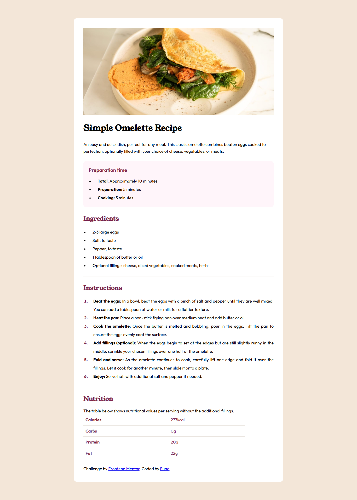

# Frontend Mentor - Recipe page solution

This is a solution to the [Recipe page challenge on Frontend Mentor](https://www.frontendmentor.io/challenges/recipe-page-KiTsR8QQKm). Frontend Mentor challenges help you improve your coding skills by building realistic projects. 

## Table of contents

- [Overview](#overview)
  - [Screenshot](#screenshot)
  - [Links](#links)
- [My process](#my-process)
  - [Built with](#built-with)
  - [What I learned](#what-i-learned)
- [Author](#author)

**Note: Delete this note and update the table of contents based on what sections you keep.**

## Overview

### Screenshot

### Links

- [Solution](https://www.frontendmentor.io/solutions/recipe-page-using-basic-html-and-css-for-responsive-design-dYr-9iTb80)
- [Live Site](https://poplarbeargi.github.io/recipe-page/)

## My process
I start by assigning tags for the content inside the index.html first, doing so helps me to familiarise myself with each section. After that, I began to tinker and style the page with the CSS file. Nothing too fancy, I don't use Flexbox or grid.

### Built with

- Semantic HTML5 markup
- CSS custom properties
- Mobile-first workflow

### What I learned

There was nothing too major when I created this, but it helped me hone my basic CSS and HTML, especially Media Query.

## Author

[@poplarbeargi](https://www.frontendmentor.io/profile/poplarbeargi)
